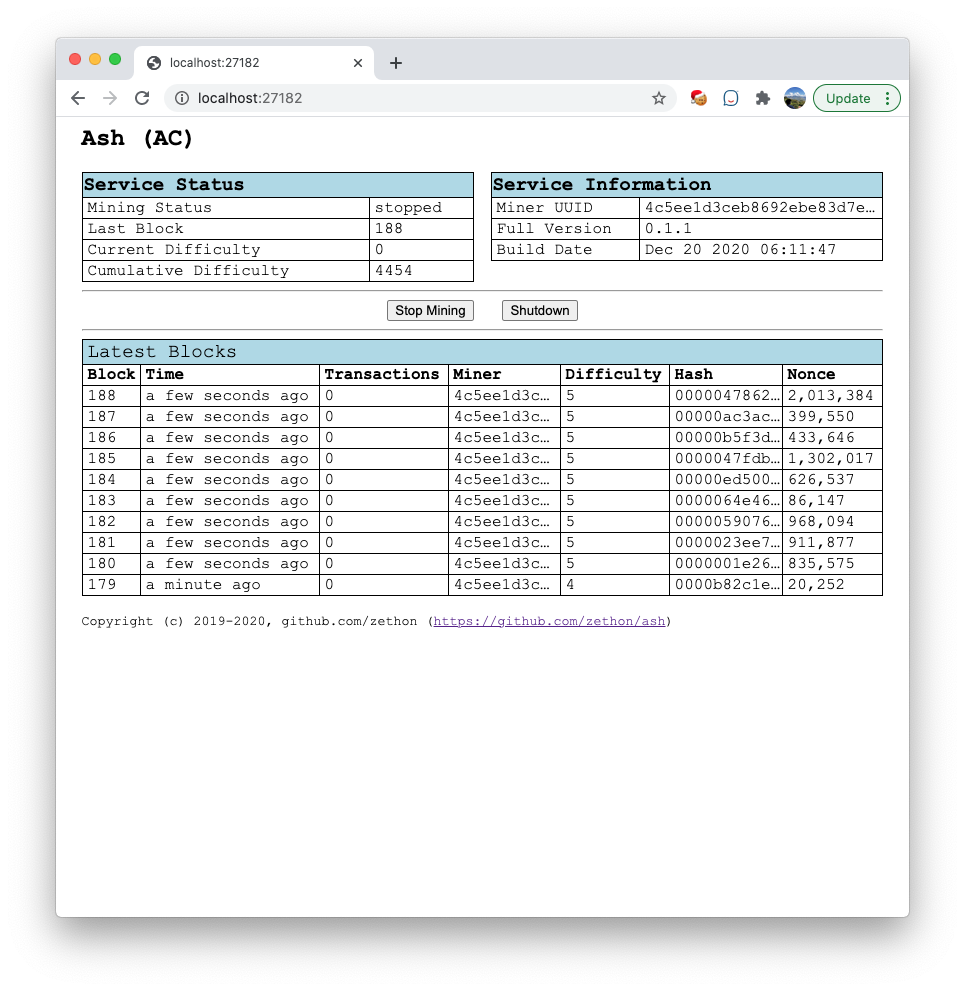

# Ash

Ash is a crypto-currency built from scratch.

The goals with this project are:

* **Mining**: A single chain is synced across a peer-to-peer network based on cumulative difficulty
* **Networking**: Miners can join/leave the mining network without any configuration on a central node.
* **Wallets**: Users can send coins from one wallet to another.
* **Security**: The network should be smart enough to reject basic attempts at forging chains and transactions.

A lot of this project is based on [this Javascript tutorial](https://lhartikk.github.io/jekyll/update/2017/07/15/chapter0.html). However this project uses C++ (as of this writing I am using C++17, but hope to switch to C++20 soon). 

**NOTE**: This is **a fun project**. I am writing this to learn about blockchains and crypto currency. **I am not an expert**. This is not intended to be a real crypto currency.

## Documentation

1. [Settings File](settings.md)