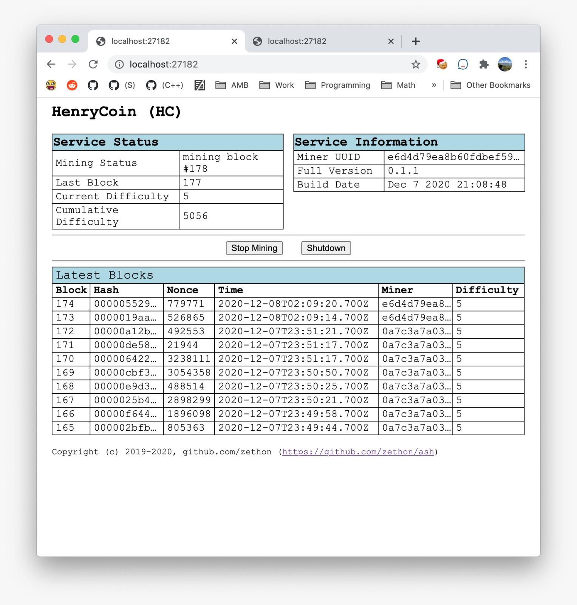

# HenryCoin

HenryCoin is a crypto-currency built from scratch.

The goals with this project are:

* **Mining**: Mining is synced across a peer-to-peer network with a single chain based on cumulative difficulty
* **Networking**: Miners can join/leave the mining network without any configuration on a central node.
* **Wallets**: Users can send coins from one wallet to another.
* **Security**: The network should be smart enough to reject basic attempts at forging chains and transactions.

A lot of this project is based on [this Javascript tutorial](https://lhartikk.github.io/jekyll/update/2017/07/15/chapter0.html). However this project uses C++ (as of the writing of this I am using C++17, but hope to switch to C++20 soon). 

**NOTE**: This is **a fun project**. I am writing this to help me learn more about blockchains and crypto currency. **I am not an expert in either**. This is not intended to be a real crypto currency.

## Settings

#### `chain.reset.enable`
If you join a mining network and the remote network has a different Genesis Block then your current chain, setting this to true will erase your block database and download the remote blockhain.

#### `database.folder`
The folder in which to persist the local copy of the blockchain.

#### `logs.file.enabled`

Whether or not log messages should be saved to a file.

#### `logs.file.folder`

The folder in which to store log messages if they are being saved to a file.

#### `logs.level`

The level of log messages.

#### `mining.autostart`

Whether or not mining should start automatically when the service is started.

#### `peers.file`

The file from which to load the list of peers.

#### `rest.autoload`

Whether or not load a browser with the REST interface when the process is started in console mode.

#### `rest.port`

The port on which the HTTP service should listen.

#### `websocket.port`

The websocket port on which the websocket service should listen.
